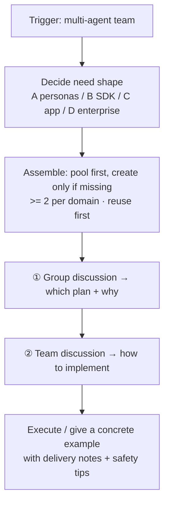

# Skill: Multi-Agent Team Builder (multi-agent-team)

In one line: **you say "build me a multi-agent team" and it picks experts from a role pool, groups them by domain, converges through "group discussion → team discussion", and hands you a runnable plan or a concrete example.**

> 🌐 Chinese version（中文版）：https://github.com/zhangruilin158/multi-agent-team —— the same skill, written in Chinese.

## Full-flow diagram



## What it does

1. **No agonizing over selection** — internally decide the need shape and build it; never stop at a pure suggestion.
2. **No hand-written team** — reuse ready-made expert personas from the Unified Role Pool (304 unique roles / 19 domains); create only what's missing.
3. **Two-stage discussion convergence** — every domain gets >= 2 experts as a group: the group picks the plan, the team decides implementation.
4. **Runnable delivery** — ships a pluggable-engine scaffold; change one `TEAM` config and it runs.

## What's in the package

```
multi-agent-team/
├── SKILL.md                        # the skill itself (full rules)
├── README.md  UPLOAD.md  LICENSE
├── references/
│   ├── unified-role-pool.md        # ★ deduped 304 roles —— for team-building
│   ├── agent-master-list.md        # ★ non-deduped 330 entries —— for discussion
│   ├── functional-overview.md      # all flowcharts (7 Mermaid diagrams)
│   ├── framework-overview-and-selection.md
│   └── team-building-flow.svg
└── assets/multi-agent-team-demo/   # runnable scaffold
    ├── team_config.py              # ★ the only file you edit: TEAM list + ENGINE
    ├── build_team.py               # assemble & run (with domain-group size check)
    ├── engines/                    # engine plugin layer: lightweight / mock
    ├── requirements.txt  .env.example  README.md
```

> **Role library published separately**: the role content lives at `https://github.com/zhangruilin158/agent-role-libraries` (original licenses retained in `LICENSES/`). Clone it when you need it.

## Role resources: two views

| View | File | Content | Used for |
|------|------|---------|----------|
| **Team-building** (deduped) | `unified-role-pool.md` | **304** unique roles / 19 domains | final team config |
| **Discussion** (non-deduped) | `agent-master-list.md` | **330** entries (305 agents + 25 workflow skills) | group-discussion recruitment |

Why keep duplicates for discussion? The value of group discussion is **comparing different agents' thinking** — same name & duty but different source can yield different plans.

## Team collaboration rules (core)

- **>= 2 experts per domain**: domains with < 2 roles (`research` / `integrations`) are filled from close domains.
- **Two discussion types differ**:

| | Group discussion (in-group) | Team discussion (cross-domain) |
|---|---|---|
| Focus | the plan itself | how the plan fits the current task |
| Output | **which plan + why** | **how to implement that plan** |

- **Convergence order**: group discussion → one recommendation per domain → team discussion → execute or give a concrete example.
- **Ultra-terse communication**: conclusion + key reason only (constrains the discussion process only, not the final deliverables).

## Quick start

```bash
python -m venv .venv
.venv\Scripts\pip install -r requirements.txt      # Windows; macOS use .venv/bin/pip

.venv\Scripts\python build_team.py --dry-run        # free team preview (no model call)
copy .env.example .env                              # fill in API Key (or a compatible provider)
.venv\Scripts\python build_team.py --topic "your topic"
```

The engine is pluggable: default `lightweight`, plus the zero-dependency `mock` (`--engine mock` demos directly).

## Install (migrate / share)

Copy the whole `multi-agent-team/` into the skills directory:

- User-level: `~/.workbuddy-ai/skills/multi-agent-team/`
- Project-level: `<project>/.workbuddy-ai/skills/multi-agent-team/`

## Trigger words

"multi-agent" · "multi-agent team" · "build me a multi-agent team"

## Safety reminders

- Secrets only in `.env`, never hard-coded or committed; inputs go to your configured LLM provider — don't feed private data.
- A persona pack runs in your coding tool with **the same file/command permission** — Review the persona before enabling, and beware of prompt injection.
- Real runs are billed per token; put code-running Agents behind a sandbox.

---

> Full rules (assembly iron rule, four shapes, five capability types, safety notes) are in **`SKILL.md`**; all flowcharts are in **`references/functional-overview.md`**.
