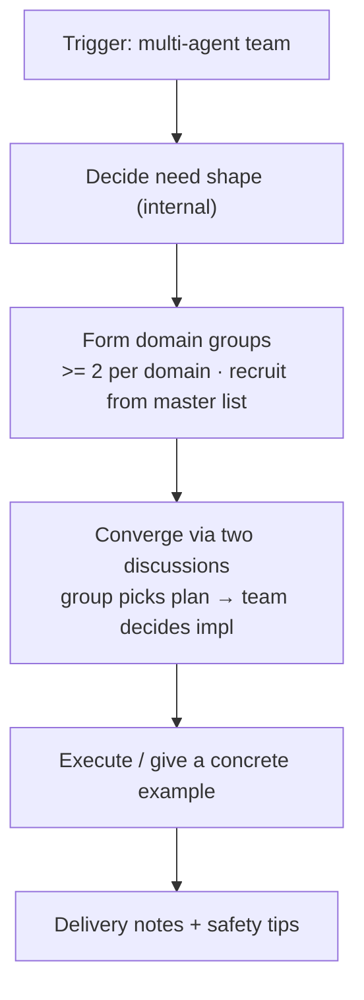
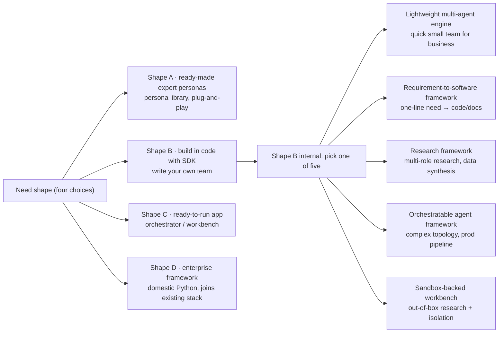
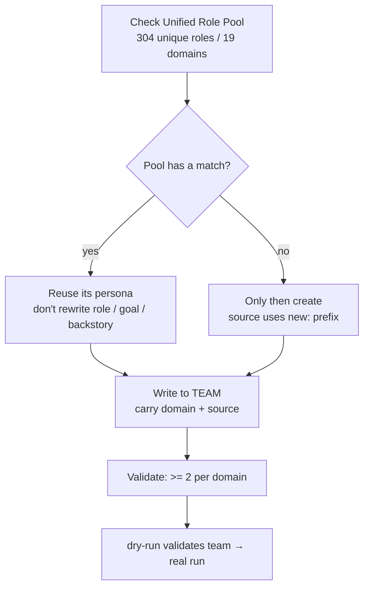
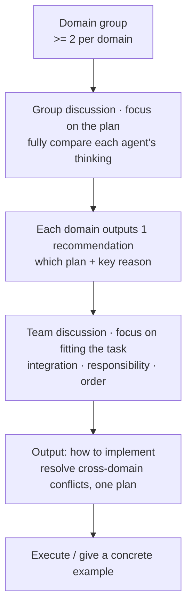
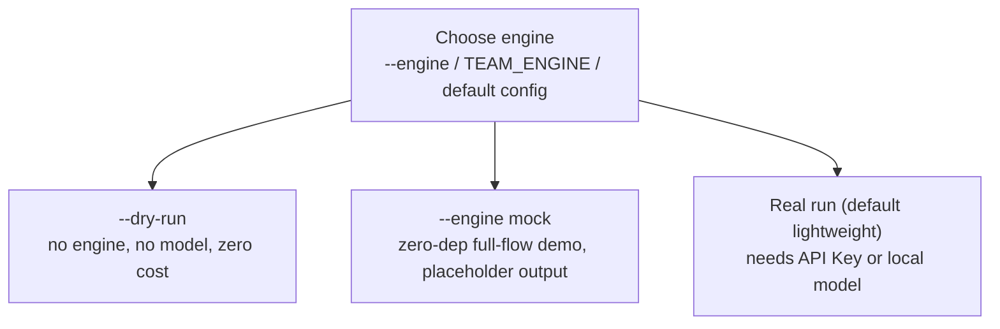
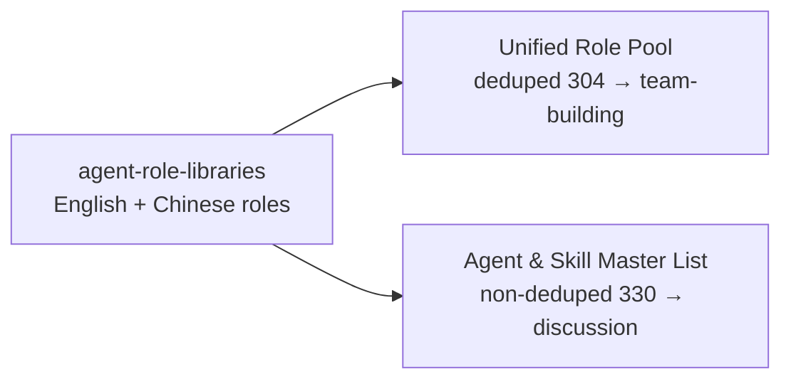
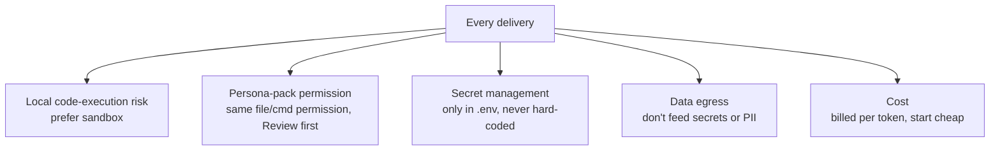

# Functional & Process Overview

> This file summarizes all the skill's functions and flows as flowcharts.
> Written in Mermaid, they **render directly as diagrams** on GitHub / any Mermaid-capable Markdown reader.

## ① End-to-end main flow

## ② Need-shape decision → capability types

## ③ Assembly iron rule: pool first, create only if missing

## ④ Two discussions & convergence (core rule)

**Division of labor between the two discussions**:

| | Group discussion (inside domain group) | Team discussion (cross-domain, whole team) |
|---|---|---|
| Focus | the plan itself | how the plan fits the current task |
| Output | which plan + why | how to implement that plan |

**Communication constraint**: ultra-terse throughout — conclusion + key reason only (constrains the discussion process only, not the final deliverables).

## ⑤ Execution: pluggable engine

## ⑥ Role resources: two views

> Why discuss with the non-deduped list? The value of group discussion is **comparing different agents' thinking** — same name & duty but from different libraries can yield different plans, so duplicates stay in.

## ⑦ Safety notes (prompt on every delivery)

